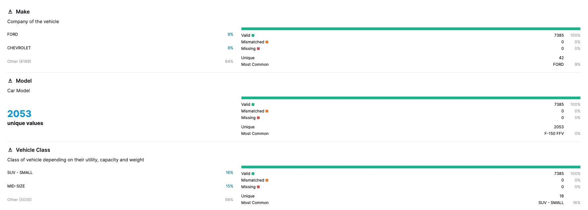
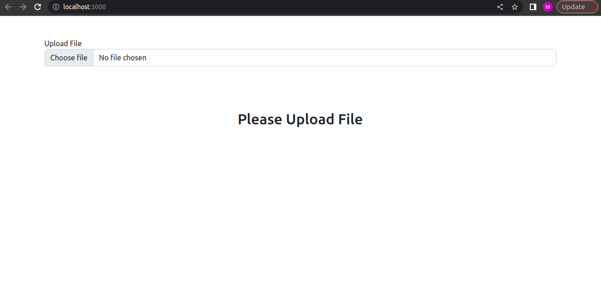
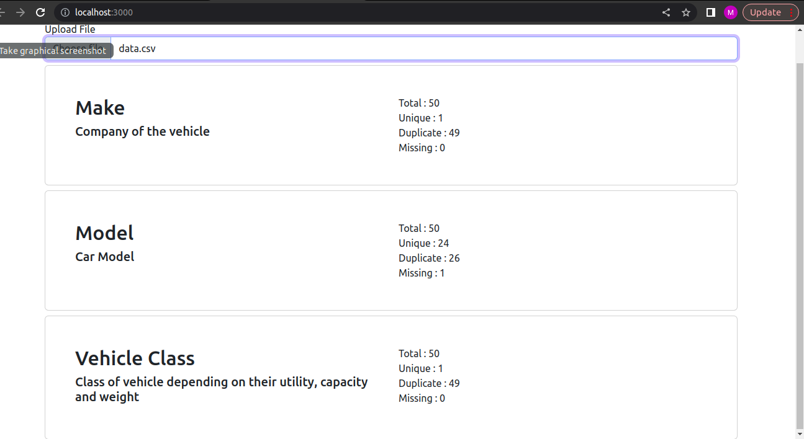

# [JS] Tech Challenge

Thank you for participating!
We appreciate the time you put into our conversations and this excercise.

## Visualize a data-file

The dataset `../data/data.csv` contains official records of CO2 emissions data by various cars of different features.
There are total 7385 rows and 12 columns.

Take a look at `../data/Data Description.csv` for further info regarding the columns.

Due to manual input errors, some values are either missing, have outliers, ...

## Your task

Please build a React.js mini-frontend to load the dataset and visualize, this view:

You don't need to take the full 7385 rows, 10% should be enough.

How to approach the task:

- There is no "right" or "wrong" way of doing this! We are not looking for a perfect solution.
- We would like to see how someone approaches the problem (e.g., use comments, and git commit messages)
- We also would like to see what's important to you (e.g., if you want to write a test, feel free to do it)
- Please timebox the excercise to 2-4h, we know you have a lot to do on the side and this should be no big stress factor
- Once you're done, please send a zipped git-folder back, or just commit it to Github/Gitlab/... and send us the link

## Output View

